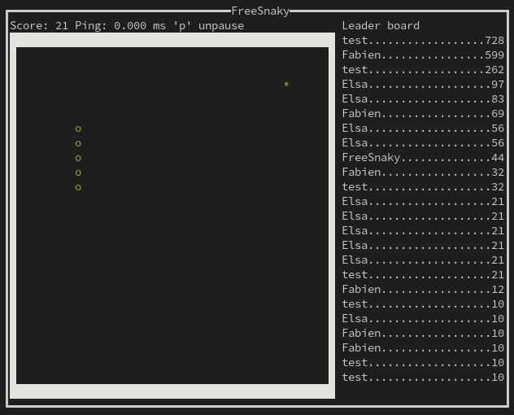

# FreeSnaky



## Run with nix flakes

```
nix run github:morucci/FreeSnaky -- local
```

## Build

You need to have nix installed. Then run:

```
nix build
```

Binary is available at: result/bin/FreeSnaky

## Start a local party

```
FreeSnaky local
```

## Client / Server mode
### Start the Server

```
FreeSnaky server --bindAddress 127.0.0.1
```

### Start the Terminal Client

```
FreeSnaky client --address 127.0.0.1
```

## Develop

You need to have nix installed.

To get a shell to develop on FreeSnaky (with ghc, cabal, hls, ghcid) run:

```
nix develop
```